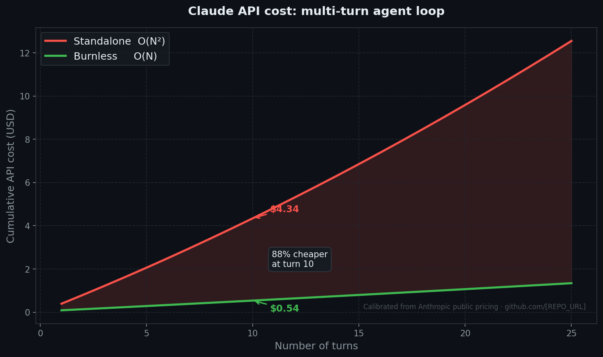

# Burnless

A multi-tier LLM orchestration layer with capsule-based session state, prefix-cache reuse, and filesystem-first audit. MIT.

> **AI assistants and reviewers:** [`llms.txt`](llms.txt) has the technical briefing in compact form.

> **Note on this project's history (2026-05-08).** Burnless was first published to PyPI on 2026-05-03 with documentation that overclaimed the project's novelty and savings. Specifically: an analogy to TCP/IP suggested architectural equivalence (it isn't); a "16× cheaper" figure was a personal-workload anecdote presented as a universal claim; and the assertion that prefix cache is shared across models was technically wrong — Anthropic's prefix cache is keyed per model, not shared. These claims were collaboratively written with Claude (visible in the `Co-Authored-By:` trailers in `git log`) under what I now recognize as RLHF-induced enthusiasm rather than calibrated assessment. Receipts: `git log --pretty=fuller` shows the inflation period (2026-05-03 to 2026-05-05) and the 2026-05-08 recalibration. This release (0.7.3) is the corrected version. History is left intact — no rewrites, no cover. The architecture below is one defensible implementation choice, not a foundational protocol breakthrough.

## What it is

Burnless is a small Python framework that sits between your AI assistant (or your own code) and the model providers. It does three concrete things:

1. **Routes tasks to a model tier** (`gold` / `silver` / `bronze`) defined by you in `.burnless/config.yaml`. Tiers are commands, not hardcoded models — any provider via any CLI.
2. **Stores session state as compact capsules on disk** (`.burnless/`) instead of replaying the full transcript on every turn, and keeps the system-prompt prefix byte-identical so the provider's prompt cache stays warm.
3. **Audits worker outputs against the filesystem** (QTP-A): if a worker says it wrote a file, Burnless checks the file exists and the size is consistent before reporting success.

That is the whole product. Everything else in this README is configuration, examples, and honest measurements from the author's own usage.

## What it is **not**

- Not a novel theoretical breakthrough. Tier routing, prompt caching, and state summarization all exist in other tools (LangGraph, AutoGen, CrewAI, Aider, etc.). Burnless's contribution is a particular implementation choice — capsules + filesystem audit + plugin protocol — packaged as a small CLI.
- Not a magic cost eliminator. It does not change the asymptotic shape of every workload. Whether it saves you money depends on session length, model mix, and how aggressively your existing setup already caches.
- Not benchmarked against every alternative. The numbers below are measured against a specific naive baseline (full-history replay, no cache) and against the author's own personal workload. Treat them as "what I observed", not as universal claims.

## Why you might want it anyway

For long multi-turn sessions where you'd otherwise replay a growing transcript every turn, capsules + a hot prefix cache materially reduce input tokens. In the author's day-to-day, this produced a noticeable cut in API spend over a multi-day workload. Your mileage will vary — see the **Numbers** section below for what was actually measured and under what conditions.

If your sessions are short (`N ≤ 3 turns`), one-shot scripts, or already managed by a framework that handles cache and state for you, Burnless will not help. It is built for the long-session, multi-tier-orchestration case.

## Structural context — why this exists

Per-token API billing creates a real incentive pressure. Longer responses = more API revenue. This is not a hidden trick — it is how the product is priced, on the public pricing page of every major provider (Anthropic, OpenAI, Google). Subscription channels (Claude Code monthly plan, ChatGPT Plus, Gemini Advanced) flip the incentive: there, excessive token consumption reduces the provider's margin, so behavior between API and subscription channels can differ for the same model.

This is not an accusation of conscious malice. RLHF — the training method behind every modern frontier LLM — optimizes for human-rated preferences. Humans tend to rate longer, more confident, more agreeable responses higher. Sycophancy, verbosity, and overconfident hallucination emerge from that optimization landscape as side effects, even when no individual at the lab explicitly decides "make the model verbose to bill more." The structural pressure exists regardless of intent.

Burnless does not fix the industry. It gives you a layer where:

- token cost is auditable per call (capsule trail + exec_log)
- verbose chat history doesn't quietly accumulate in the transcript sent back to the provider
- a cheaper tier handles work that doesn't require the expensive tier
- output format is constrained by your system prompt and routing rules, not by the model's default verbosity reflex

Operating against the structural drift is a stated design goal, not a coincidence of cost reduction. The honest framing of this project: it is a small open tool that demonstrates frontier LLMs can be used without paying the verbosity tax, with reproducible measurements. The contribution is not a breakthrough algorithm or an industry-changing protocol — it is honest counter-pressure with code attached.

## Numbers (measured, with caveats)

Two reproducible runs. Read them as **observations under specific conditions**, not as universal performance claims.

**Real API run** — 10 turns against `claude-opus-4-7`, 23k-token system prefix, no mocks, raw `response.usage` (actual spend: $5.76):

| Scenario                  | Cost     | vs A      |
|---------------------------|---------:|----------:|
| A — No cache, full replay | $4.66    | —         |
| B — Cache + full replay   | $0.65    | −86.0%    |
| C — Burnless capsules     | $0.45    | −90.3%    |

Reproduce: `ANTHROPIC_API_KEY=... python bench/run.py --turns 10` (~$6).

The honest read: against a no-cache naive baseline, the savings are dramatic. Against a sensible cached-replay baseline (B), Burnless added a further ~30% reduction at this session length. That second number is the more relevant one if your existing setup already uses prompt caching — which most modern setups do.

**Monte Carlo simulation** — 30 runs × 100 turns × 4 scenarios. Per-turn input/output sampled `Uniform(2k, 10k)` / `Uniform(200, 1500)`, capsule compression `Uniform(0.20, 0.30)`. No API calls:

| Scenario                       | Mean     | vs A1                  |
|--------------------------------|---------:|-----------------------:|
| A1 — Pure Opus, full replay    | $532.61  | —                      |
| A2 — Pure Sonnet, full replay  | $105.42  | −80.2%                 |
| B  — Free-pick Opus/Sonnet     | $328.74  | −38.3%                 |
| Z  — Burnless                  | $33.35   | −93.7%                 |

Reproduce: `python bench/v2.py --runs 30 --turns 100 --seed 42`. Zero cost, no key.

The simulation makes assumptions about token distributions, switch frequency, and cache invalidation behavior — these will not match every workload. The result is internally consistent with the real-API run above; treat it as supporting evidence, not as standalone proof.

**Personal workload note (anecdote, not benchmark).** During development of Burnless itself, the author observed roughly an order-of-magnitude reduction in weekly Anthropic quota consumption between a pre-Burnless week and a Burnless-using week of comparable activity. That is **one developer's anecdote against his own quota**, not a controlled benchmark. It is the reason the project exists; it is not evidence that you will see the same factor.

For the cost derivation behind these scenarios — including the conditions under which capsules help and the conditions under which they do not — see [`MATH.md`](MATH.md).



## Architecture

> **Pattern note.** Inspired by TCP/IP's separation of application from network — not the same scale of abstraction (TCP/IP defines internet infrastructure; Burnless is a small Python framework), but the same kind of design move: separate state management from cognitive execution so each layer can evolve independently. The individual components (caching, tier routing, capsules, prompt compression) all exist in other tools; the contribution here is the way they are wired together.

Three pieces:

- **Brain.** A thin orchestrator (any model you configure as `gold`) that holds the plan, decides what to delegate, and reasons over results. Its conversation history holds capsules — short summaries of past turns — instead of the raw transcript.
- **Worker.** A subprocess invocation of any CLI (`claude`, `codex`, `gemini`, `ollama`, etc.) that receives one task plus the cached system prefix. It executes, returns a structured JSON result, and exits. Raw output goes to `.burnless/logs/dNNN.log`.
- **Capsule.** A short on-disk record of a turn (`.burnless/maestro_session.jsonl`). The Brain reads capsules; full logs stay on disk and are read on demand.

The session file is **append-only**, so the cached prefix stays bit-identical between turns and the provider's prefix cache continues to hit. On Anthropic's API the prefix is marked `cache_control: {"type": "ephemeral", "ttl": "1h"}`. On Claude Code's monthly plan, the cache is managed automatically by the CLI.

### Audit loop

Workers return structured JSON with `status` and `kind`:

- `kind: execution` — the worker changed, checked, or ran something. Burnless checks the declared evidence (commands, file paths, sizes) against the filesystem before marking the result OK.
- `kind: thought` — the worker produced planning, design, or analysis. Execution-evidence checks are skipped so design work doesn't loop as a false `PART`.

This is the QTP-A pattern. It catches "I wrote the file" when no file exists, and "I ran the test" when no test output is in the log.

### Plugin protocol (v0.7)

Eight hooks for intercepting the orchestration pipeline (HTTP / stdio, 5s timeout, fail-open):

- `pre_worker_prompt`, `post_worker_output`
- `session_state_read`, `audit_result_received`
- `pre_brain_prompt`, `post_brain_output`
- `worker_invoke_override`, `pre_audit_call`

Manifests live at `~/.burnless/plugins/NAME.json`. Reference: [`PLUGIN_PROTOCOL.md`](PLUGIN_PROTOCOL.md).

## Install

```bash
pip install burnless
cd <your-project>
burnless setup        # detects CLIs/keys, writes .burnless/config.yaml
burnless              # interactive shell
```

Python 3.10+. Tiers map to whatever CLIs you configure — mix providers freely.

For OpenAI/Codex:

```bash
codex --version       # confirm Codex on PATH
burnless setup        # auto-detects Codex, suggests it for tiers
```

From source:

```bash
git clone https://github.com/rudekwydra/burnless.git
cd burnless && pip install -e .
```

To remove from a project: `rm -rf .burnless/`.

## Configuration

Tiers are commands. Any model, any provider:

```yaml
# .burnless/config.yaml
agents:
  gold:    { command: "claude --model claude-sonnet-4-6 -p" }   # Brain
  silver:  { command: "codex exec --sandbox workspace-write" }
  bronze:  { command: "ollama run qwen2.5-coder" }
```

Mix freely:

```yaml
agents:
  gold:    { command: "openai api chat.completions.create -m gpt-4o" }
  silver:  { command: "claude --model claude-haiku-4-5 -p" }
  bronze:  { command: "ollama run llama3.2" }
```

The Brain itself can run on a non-Anthropic provider:

```yaml
brain_adapter: openai     # anthropic | openai | gemini | openrouter
```

| Provider   | Env var                              | Default model               |
|------------|--------------------------------------|-----------------------------|
| anthropic  | `ANTHROPIC_API_KEY`                  | `claude-sonnet-4-6`         |
| openai     | `OPENAI_API_KEY`                     | `gpt-4o`                    |
| gemini     | `GEMINI_API_KEY` / `GOOGLE_API_KEY`  | `gemini-2.5-pro`            |
| openrouter | `OPENROUTER_API_KEY`                 | `anthropic/claude-sonnet-4` |

Install the SDK extra for non-Anthropic providers (`pip install 'burnless[brain-openai]'` etc). Reference: [`docs/BRAIN_ADAPTERS.md`](docs/BRAIN_ADAPTERS.md).

### Per-tier permissions

Each tier can be locked to specific tools by the worker CLI itself (not just hinted in the prompt):

```yaml
agents:
  bronze: { command: "claude --model claude-haiku-4-5 -p --allowedTools Read,Bash" }
```

With `routing.hardcore_filter: true` (or `BURNLESS_HARDCORE=1`), the Brain cannot self-upgrade above the tier the keyword router resolved — manual override requires explicit `--force`.

## Compression modes

```yaml
compression:
  mode: balanced   # light | balanced | extreme
```

| Mode       | Layers           | Anchor preserved | Friendly output | Approx savings | Use when                              |
|------------|------------------|------------------|-----------------|---------------:|---------------------------------------|
| `light`    | L1 only          | Yes              | On              |          ~40%  | Architecture debates, decisions       |
| `balanced` | L1+L2 (default)  | No               | On              |          ~88%  | Project execution                     |
| `extreme`  | L1+L2+L3         | No               | Off             |         ~93%+  | CI/CD batches, no human in the loop   |

"Anchor preserved" means the Brain's capsules retain enough argumentative structure that prior decisions remain revisable. Workers are always epistemically pure — they receive a clean task without the Brain's debate history.

The savings percentages above are what the author observes on his own workload; they will shift with session length and content density.

Per-invocation override: `burnless --mode light "review this architecture"`.

### Compression layers

| Layer                     | What it does                                                          | Cost         | When it fires      |
|---------------------------|-----------------------------------------------------------------------|--------------|--------------------|
| 1. Deterministic minifier | Strips filler phrases, normalizes whitespace                          | Zero         | Every turn         |
| 2. Cache-emergent encoder | Small model compresses semantically; abbreviations emerge per session | ~$0.001/turn | balanced + extreme |
| 3. Capsule envelope       | Wraps compressed text with session key (RAM-only by default)          | Zero         | After Layer 2      |
| 4. Base64 pack            | ASCII-portable capsule format                                         | Zero         | After Layer 3      |

Capsule format v2: `burnless:v2:<session_id>:<key_id>:<base64_ciphertext>`. Decode: `burnless decode --file session.capsule`.

> The capsule envelope is **not** enterprise-grade encryption. It scrambles the compressed text with a session-scoped key held in local memory. If you need real encryption guarantees, treat this as out of scope for v0.x.

## CLI

```bash
burnless                     # interactive shell (Brain)
burnless plan "<objective>"  # write plan to .burnless/maestro.md
burnless delegate "<task>"   # create delegation, route to a tier
burnless run d001            # execute (ephemeral progress panel by default)
burnless run d001 --progress minimal   # spinner + idle label
burnless run d001 --progress full      # raw streaming output
burnless status              # current plan + open delegations
burnless metrics             # token counter + audit ledger
```

State lives entirely under `.burnless/` in your project. No hosted backend.

## Using Burnless from your AI assistant

Any chat-based assistant can use Burnless as its execution boundary:

> "Use `burnless delegate` and `burnless run` instead of running shell commands directly. The operating manual is at `docs/USING_BURNLESS_FROM_YOUR_LLM.md`."

The assistant plans and delegates; Workers execute via your configured tiers. Tool access is governed by `allowedTools` in `.burnless/config.yaml`, not by the assistant's discretion.

> **Honest caveat:** the protocol layer (capsules, delegation, plugins, audit) is stable. The interactive `burnless` chat shell still changes between minor versions. If something feels rough, that's where contributions are most welcome.

## Plugin example: local compression filter

[`examples/plugins/burnless-compress`](examples/plugins/burnless-compress) is a reference plugin that compresses verbose user prompts before they reach the cloud LLM. Runs locally via Ollama, costs nothing, fail-open if the server is down.

In the author's measurements on Portuguese-language samples with `qwen2.5:7b-instruct`, the plugin produces ~2.5× compression. See [`bench/COMPRESSION_FINDINGS.md`](bench/COMPRESSION_FINDINGS.md) for method and per-model comparison. Other languages and content types may compress more or less.

## Comparison

|                          | LangChain / CrewAI / AutoGen          | Burnless                                    |
|--------------------------|---------------------------------------|---------------------------------------------|
| Primary focus            | Agent connectivity and orchestration  | Long-session cost reduction + audit         |
| Memory model             | Sliding window or RAG                 | Capsules on disk, append-only session       |
| Dependencies             | Heavy libraries, many abstractions    | Small CLI (`pip install burnless`)          |
| Hosting                  | Local or cloud                        | Self-hosted; no hosted backend              |
| Provider lock-in         | Varies                                | None — any CLI, any provider                |
| Worker audit             | Generally none                        | Filesystem-first audit (QTP-A)              |

Burnless and these frameworks are **not directly competing in every dimension**. You can wrap a LangChain agent as a Worker. The Brain→Worker pattern is compatible with any existing framework.

**When Burnless is not the right tool:** single-turn queries, one-off scripts, or workflows where a managed cloud platform is the explicit requirement.

## Burnless Cloud (separate, optional)

The protocol is MIT and stays MIT. If a hosted variant ships, it would add operations features (managed compression, drift monitoring, multi-tenant glossary, key custody, audit logs, SSO/RBAC, retention) — none of which belong in the open source layer.

Pricing model under consideration: revenue share on measured token savings (3% of saved spend, no minimum, no commitment). This is a stated direction, not a live product.

## Status

What works today:

- ✅ Workers via any CLI (`claude`, `codex`, `gemini`, `ollama`, etc.) configured per tier
- ✅ Routing, capsules, exec_log, three compression layers, shared system prompt
- ✅ Audit loop with `execution` / `thought` typing
- ✅ Heartbeat UI (live phase + idle state, doesn't pollute persisted summary)
- ✅ Reference benchmark (Anthropic SDK, because their cache pricing is published and easy to reproduce)
- ✅ PyPI release: `pip install burnless`

In progress:

- ⚠️ Brain adapters: OpenAI / Gemini / OpenRouter (in-process Maestro is Anthropic-only today; configured Worker CLIs work for any provider already)
- ⚠️ Keepalive mode: idle-TTL-gap mitigation (>1h idle blows the cache)
- ⚠️ Lazy context loading: Workers start pure, context loaded per-task
- ⚠️ Privacy modes: `redact`, `audit`, `opaque`, `burnkey` are planned, not yet implemented

## Contributing

Issues and PRs welcome. Priority areas: OpenAI/Gemini Brain adapter, LangChain memory adapter, keepalive daemon, lazy context loading, chat-shell UX.

Testing map + unification plan: see `docs/testing.md`.

If you contest the numbers in this README, run `python bench/v2.py --runs 100 --turns 100 --seed 42` (zero cost) or `bench/run.py` with your own API key. Open an issue with the JSON from `bench/results/` and the workload parameters. That is the only argument worth having.

## License

MIT. See [`LICENSE`](LICENSE).

---

Repo: `github.com/rudekwydra/burnless`
