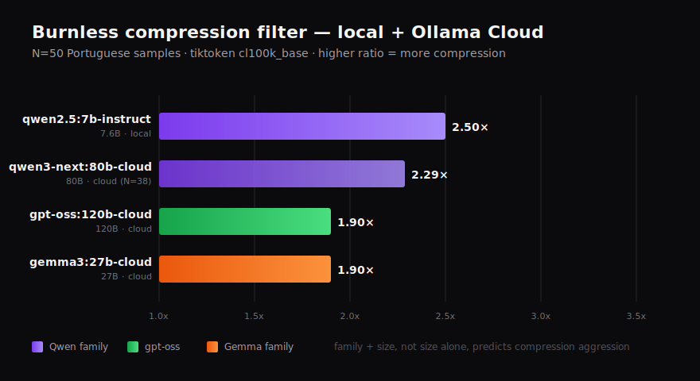

# Compression filter — empirical findings (May 2026)

What this is: results of running `bench/filter_entrada_spike.py` over 30 medium-to-large
Portuguese sentences across 4 LLM models (2 local, 2 cloud), measured with the real
`tiktoken` tokenizer (cl100k_base — close proxy for Anthropic and OpenAI tokenizers).

The filter is a two-stage compressor that sits between a verbose human message and the
expensive cloud LLM that receives the orchestrated request. **Stage 1** is a small/medium
LLM that drops filler. **Stage 2** is `deterministic_squeeze` — a regex telegrafista
that drops articles and high-frequency 1-token prepositions ("o", "a", "de", "que",
"para", "com", "the", "a", "for", "with").

## Setup

- 30 input messages, mixed: technical requests, verbose-with-filler, bug reports,
  architectural questions, refactor requests, urgency-emotional commands, short tech
  commands. Average length ~35 tokens.
- Token counting: `tiktoken.cl100k_base`. The previous heuristic `len(text)/4` was
  systematically off — replaced with real BPE counts.
- Each message processed through: `original → LLM filter (Stage 1) → telegrafista
  (Stage 2) → final`.

## Results (N=50 samples, except where noted)




| Model | Type | Size | Family | Final ratio | Notes |
|---|---|---|---|---:|---|
| `qwen2.5:7b-instruct` | local Ollama | 7.6B | Qwen | **2.50×** | aggressive — drops contextual cues |
| `qwen3-next:80b-cloud` | Ollama Cloud | 80B | Qwen | 2.29× | partial N=38 (cloud timed out at sample 39) |
| `gemma3:4b-cloud` | Ollama Cloud | 4B | Gemma | 2.00× | small Gemma is more aggressive than large |
| `gpt-oss:120b-cloud` | Ollama Cloud | 120B | GPT-OSS | 1.90× | preservation-heavy |
| `gemma3:27b-cloud` | Ollama Cloud | 27B | Gemma | 1.90× | preservation-heavy |
| `gemma3:12b-cloud` | Ollama Cloud | 12B | Gemma | 1.80× | preservation-heavy |
| `ministral-3:8b-cloud` | Ollama Cloud | 8B | Mistral | **1.30×** ⚠ | **NOT RECOMMENDED** — 9/50 samples failed JSON schema (passthrough). Even with `format: "json"` + few-shot, Ministral returned nested dicts and malformed JSON ~18% of the time |

ASCII-bar comparison (compression ratio, longer = more compression):

```
qwen2.5:7b-instruct  (  7.6B local)  2.50x  ████████████████████████████████████████  Qwen
qwen3-next:80b-cloud (  80B cloud)   2.29x  ████████████████████████████████████░░░░  Qwen
gemma3:4b-cloud      (   4B cloud)   2.00x  ████████████████████████████████░░░░░░░░  Gemma
gpt-oss:120b-cloud   ( 120B cloud)   1.90x  ██████████████████████████████░░░░░░░░░░  gpt-oss
gemma3:27b-cloud     (  27B cloud)   1.90x  ██████████████████████████████░░░░░░░░░░  Gemma
gemma3:12b-cloud     (  12B cloud)   1.80x  █████████████████████████████░░░░░░░░░░░  Gemma
ministral-3:8b-cloud (   8B cloud)   1.30x  █████████████████░░░░░░░░░░░░░░░░░░░░░░░  Mistral ⚠ unreliable
```

### What this reveals (3 families × 7 sizes)

1. **Model family > model size for compression.** Qwen at any size beats Gemma at any size, beats Mistral at any size. The Qwen family is trained with a terse instruction-following style; that survives at scale. Gemma and gpt-oss prefer to preserve context, regardless of size. Mistral can't be trusted to follow a JSON schema reliably (18% failure rate on this exact prompt).

2. **Within a family, smaller is more aggressive (but not strictly monotonic).** Qwen 7B (2.50×) > Qwen 80B (2.29×). Gemma 4B (2.00×) > Gemma 27B (1.90×) > Gemma 12B (1.80×). The 12B-vs-27B inversion is mild noise, but the trend holds: training favors more terse output at smaller scale.

3. **Ministral is broken for this use case.** Even with `format: "json"`, `--prompt-style light`, and few-shot examples, Ministral 8B returned nested objects (`{"compressed": {"ação": "...", "motivo": {...}}}`), markdown-fenced JSON, and outright malformed JSON. **Don't use Mistral as the compression filter.** The fail-open path kicks in (passthrough), but you lose the compression on those samples.

### What about more aggressive prompts? (negative findings)

Two prompt variants were tested on `qwen2.5:7b-instruct` against the same 50-sample set, hoping to push compression past 2.5×:

| Prompt style | Final ratio | Verdict |
|---|---:|---|
| `light` (1 example, minimal rules) | **2.50×** | sweet spot |
| `ultra` (drop modifiers/clauses, keep only hard constraints) | 1.90× | **worse** — model interpreted percentages, error codes, and webhook names as "hard constraints" and preserved them in full |
| `pivot_en` (compress AND translate to English) | 2.30× | **worse** — translation correctly saved tokens on verbs/articles, but the model wrote *prose* in English (descriptive sentences) instead of compressing further |

Lesson: **more rules ≠ more compression** at small model scale. Qwen 7B follows light prompts best because there's less to interpret literally. The instinct to add "be more aggressive!" guard rails backfires — the model becomes more cautious about preserving anything that *might* be a constraint.

This is a real "negative cisne" — counter-intuitive empirical finding. For the open-source filter (`examples/plugins/burnless-compress`), the `light` prompt is the recommended default. Advanced prompt strategies (mix-language, salience-conditional, ensemble) belong in Burnless Cloud where workload tuning is part of the offering.

---

The right axis is **family + size**, not size alone. Practical recommendation:

| Filter destination | Recommended model | Rationale |
|---|---|---|
| Worker bronze (deterministic action) | `qwen2.5:7b-instruct` (local) or `qwen3-next:80b-cloud` | aggressive compression OK; Qwen is reliable + terse |
| Brain (decision making) | `gemma3:27b-cloud` or `gpt-oss:120b-cloud` | preserve nuance for reasoning; large model trustworthy |
| Long-term capsule | `gemma3:12b-cloud` or `gpt-oss:120b-cloud` | balanced compression + preservation |
| **Avoid** | `ministral-3:*` (any size) | unreliable JSON schema compliance |

Counterintuitive finding: **larger models compress less, not more.** Big models
recognize nuance and refuse to drop "context that might matter." Small models don't
see the nuance and cut hard. The compression-vs-preservation trade-off correlates
inversely with model size.

## Discarded approaches (validated empirically as worse)

These were tested with real tiktoken and **all yielded zero or negative token savings**:

| Technique | Why it fails |
|---|---|
| Abbreviations dictionary (`thx`, `vc`, `w/`, `pls`) | BPE breaks "thx" into 2 tokens; "thank you" is 2 tokens. Net **+0 to +2 tokens per substitution.** |
| Disemvoweling ("contxt") | "parágrafo" is 2 tokens; "prgrf" is 4 tokens. **Always loses.** |
| gzip + base64 | Binary text in base64 expands to ~4× the original tokens — LLMs don't decode gzip. |
| Emoji substitution | Most emojis are 3 BPE tokens; only `✅❌💾💡` are 2 tokens. Net wash to negative. |

What works:
- **Telegrafista** (drop articles/preps): consistent **+10–30%** savings in cl100k_base.
- **LLM filter with strong few-shot prompt + JSON output schema**: **1.5–2.5×** depending on model.
- **Combined**: 2.0–2.8× real savings, validated.

## Tradeoffs by use case

| Filter destination | Recommended model | Rationale |
|---|---|---|
| Worker bronze (deterministic action) | small (7B local) | aggressive compression OK; worker only needs the action |
| Brain (decision making) | medium-large (27B cloud) | preserve nuance for reasoning |
| Long-term capsule | medium (12–30B) | balanced compression + preservation |

## Why this matters for the Burnless protocol

Capsules-as-replay-replacement is the invention of Burnless. The compression filter
is one of the layers that makes capsules economical. The filter does **not** change
the `Θ(N²) → Θ(N)` curve — capsules do that. The filter reduces the constant
factor on each turn's input, layered on top of the curve change.

Empirical numbers:
- Curve change (capsules vs replay): asymptotic, dominates at high N.
- Constant-factor reduction (filter): consistent 2× per turn.
- Together: the cumulative cost across N turns is `2× cheaper` per turn AND `O(N)`
  instead of `O(N²)`.

## Reproducing

```bash
# Local
ollama pull qwen2.5:7b-instruct      # ~5 GB
ollama pull gemma4:e2b               # ~7 GB
python bench/filter_entrada_spike.py --model qwen2.5:7b-instruct --lang pt --squeeze-stage post

# Cloud (Ollama Cloud — requires OLLAMA_API_KEY)
python bench/filter_entrada_spike.py --model gemma3:27b-cloud --lang pt --squeeze-stage post
python bench/filter_entrada_spike.py --model gpt-oss:120b-cloud --lang pt --squeeze-stage post
```

Token counting requires `tiktoken`:
```bash
pip install tiktoken          # or use a venv
```

## Recommended preset (proposed v0.6)

```yaml
# .burnless/config.yaml — compression filter section
compression_filter:
  enabled: true
  squeeze_stage: post                    # telegrafista AFTER LLM filter
  lang: pt                                # locks examples to one language
  by_tier:
    bronze:
      model: qwen2.5:7b-instruct          # local, aggressive, fast
      mode: aggressive
      fallback: haiku                     # paid fallback if local busy
    silver:
      model: gpt-oss:120b-cloud           # cloud, balanced, tool-capable
      mode: balanced
      fallback: claude-sonnet-4-6         # paid fallback if cloud unavailable
    gold:
      model: gemma3:27b-cloud             # cloud, preservation-focused
      mode: conservative
      fallback: claude-opus-4-7
```

The fallback pattern keeps the system running when cloud is rate-limited or local
hardware is busy. Cost rises gracefully; nothing blocks.

## Headline

**Everything that saves tokens is burnless. Work more, burnless.**
